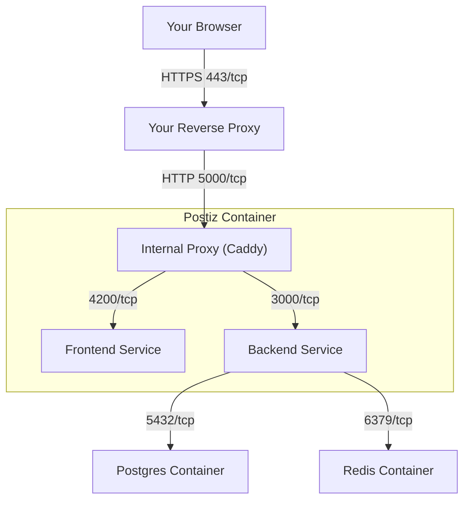

## Installation Prerequisites

This section will ask you to install & configure several services exaplained below.

### Network Requirements

#### HTTPS is required (or localhost)

Postiz marks it's login cookies as Secure, which means you must run it either on localhost, or behind HTTPS -  this is called a "secure context" in modern web browsers.

If you are not running either HTTPS or on localhost, then you will not be able to login, as your browser will refuse to send the login cookie.

Postiz will not generate your HTTPS certificates for you, and it's servers cannot yet be configured to use a HTTPS certificate. This means you must use a reverse proxy to handle HTTPS. Documentation on popular reverse proxies can be found in the [reverse proxies](/reverse-proxies/) section, and if you've never used a reverse proxy with docker compose before, then [caddy](/reverse-proxies/caddy/) is recommended.

#### Network Ports

- **5000/tcp**: for a single **single entry point** for postiz when running in a container. This is the one port your reverse proxy should talk to.
- **4200/tcp**: for the **Frontend** service (the web interface). Most users **do not** need to expose this port publicly.
- **3000/tcp**: for the **Backend** service (the API). Most users **do not** need to expose this port publicly.
- **5432/tcp**: for the **Postgres** container. Most users **do not** need to expose this port publicly.
- **6379/tcp**: for the **Redis** container. Most users **do not** need to expose this port publicly.

If you are using docker images, we recommend just exposing port 5000 to your external proxy. This will reduce the likelihood of misconfiguration, and make it easier to manage your network.

