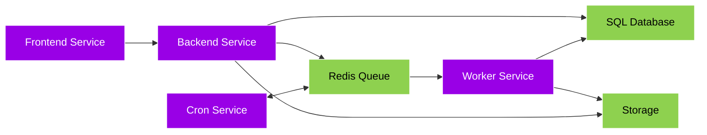

## Architecture

Postiz is composed of 4 main services and 3 external services - all 4 of the main services typically run within a **single docker container**, and talk to each other through HTTP. Those 4 main servers typically talk to other containers, running the external services - the SQL Database, Redis Queue and Storage.

- [Frontend](#frontend) - Provides the Web user interface, talks to the Backend.
- [Backend](#backend) - Does all the real work, provides an API for the frontend, and posts work to the redis queue.
- [Workers](#worker) - Consumes work from the Redis Queue.
- [Cron](#cron) - Run jobs at scheduled times.

- [Redis Queue](#redis) - A simple queue for the workers to consume work from.
- [SQL Database](#db) - Stores all the data, Postgres is typically used, but any SQL database can be used.
- [Storage](#storage) - Stores all the files, this used to be CloudFlare R2 as the default, but now it's just a local file system.

### Frontend

The frontend is the part that you see, the web interface.

It relies on the backend to:

- Schedule posts
- Show analytics
- Manage users

### Backend

The backend is the "brain" of Postiz, and coordinates all the work. Typically the SQL database it talks to is Postgres, but other databases can be used.

### Cron

The cron service does the following;

- Refresh tokens from different social media platforms.
- Check for trending change every hour and inform users about it.
- Sync the amount of stars for every repository at the end of the day.

### Worker

The worker services does the following;

- Post scheduled posts to social media platforms.
- Perform multiple jobs coming from the cron.
