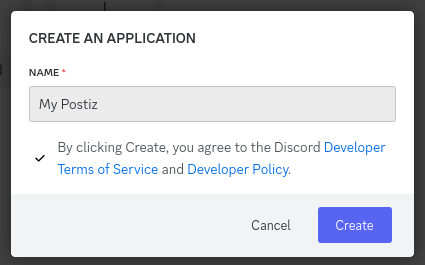
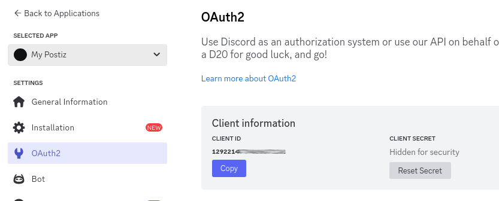

import {Steps, Callout} from "nextra/components";

<Callout>
This integration requires that you have **Manage Server** permissions on the Discord server you want to integrate with.
</Callout>

<Steps>
### Create a Discord Application
Login to Discord on the web, and then go to the [Discord Developer Portal](https://discord.com/developers/applications) and click on "New Application".


### Get and set your **Client ID** and **Client Secret** to a safe place.

You can find this in the **OAuth2** section of the Discord Developer Portal.



Set these in your .env file as follows;

```env
DISCORD_CLIENT_ID="your_client_id"
DISCORD_CLIENT_SECRET="your_client_secret"
```

### Create a Bot

Navigate to the "Bot" section of the Discord Developer Portal. Fill out the bot details however you like, and then click "Reset Token".

With the token that is generated, set it in your .env file as follows;

```env
DISCORD_BOT_TOKEN_ID="your_bot_token"
```

If you do not set this, you will get 404 errors when trying to add the Discord channel in the Postiz web interface.

Stop Postiz if it is running, and then start it using the .env file with the Discord details.

### Add a Redirect URI

The redirect URI is the URL that Discord will redirect to after you have logged in. Assuming you are runnning Postiz on `postiz.example.com`, this would be: `https://postiz.example.com/integrations/social/discord`. Alternatively if you are running on `localhost:4200`, this would be `http://localhost:4200/integrations/social/discord`.

### Add a Discord channel in the Postiz web interface

Go to the Postiz web interface, and click on the "Add Channel" button, and then select "Discord". You should be redirected to Discord to login.
</Steps>

