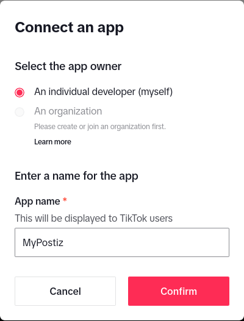

---
title: TikTok
description: How to add TikTok to your system
---

import {Steps, Callout} from "nextra/components";

<Callout>
This integration requires that you have a TikTok developer account. It also requires that you have a public website, with https, and can upload files to that site to verify ownership.

Instagram will also now allow http:// for your app redirect URI, so you will need to be accesssing Postiz from HTTPS.
</Callout>

<Steps>

### Create you app

Go here: https://developers.tiktok.com/apps



* **App Name:** `MyPostiz`
* **Redirect URI:** `http://localhost:4200/integrations/social/tiktok`

### Set a TOS and Privacy Policy

This needs to be on a public domain that you have access to, that is hosted on HTTPS. 

Tick "Web" for your platforms.

### Add apps

Add the "Login Kit" and "Content Posting API" to your app.

For "Login Kit", set the redirect URI to http://localhost:4200/integrations/social/tiktok

For Content posting API, enable "Direct Post".

### Add scopes

- user.info.basic
- video.create
- video.upload

### Copy your client secret to environment variables

These can be found immediately after registering your application. The client ID is 16 characters long and the secret is 32 characters long.


```env
TIKTOK_CLIENT_ID=1234567890123456
TIKTOK_CLIENT_SECRET=12345678901234567890123456789012
```

Restart Postiz with the updated environment variables


### Add a TikTok channel in the Postiz web interface

Go to the Postiz web interface, and click on the "Add Channel" button. Select "TikTok" from the list of available channels. You should be redirected to TikTok to authorize the application.

</Steps>

